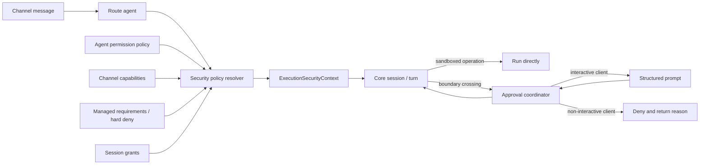

# Savfox Channel 安全授权与非阻塞执行改造方案

> 状态：v3 已实施并完成二次安全复审；P0/P2 完成，P1/P3/P4 按下文边界部分完成
>
> 方案版本：v3
>
> 基线：Savfox `577d438fe`；Codex `fe01054a28fa4bd04716d9ceadb410f2443a50ce`；Grok Build `5da6962e4adb9c857f3def762542b52b4ec3e522`
>
> 范围：Gateway Channel、Agent 权限策略、Core 审批桥接、Windows 沙箱和 PowerShell 命令策略

## 1. 结论

本次改造不应通过“Channel 默认全自动批准”解决远程授权阻塞。最优方向是：

1. 以 Codex 的“沙箱承担日常隔离、审批只处理越界”为安全底座。
2. 以 Grok 的“交互模式与无人值守模式分离、规则可记忆”为远程体验参考。
3. 将 Agent 权限策略、Channel 客户端能力和临时授权拆成三个正交维度，不能再用一个 `approval` 字段同时表达。
4. 有交互能力的 Channel 默认使用 `OnRequest + WorkspaceWrite`；正常工作区命令在真实沙箱内直接运行，只有越界操作才询问。
5. 没有可靠审批回路的 Channel 默认使用 `Never + WorkspaceWrite` 的“无人值守安全模式”；越界操作直接拒绝并让模型调整方案，不能等待一个永远不会到来的授权。
6. `DangerFullAccess + Never` 只作为显式的 `trusted-full` 管理员组合预设，永不根据远程消息、客户端类型或超时自动启用；它不是一种 Channel 响应模式。

这同时解决两个表面矛盾的问题：

- 本地和远程的普通命令不再频繁提示。
- 无人值守 Channel 不会为了减少提示而获得宿主机完整权限。

## 2. 当前实现审计

### 2.1 Agent 权限在 Channel 主路径中未生效

`crates/gateway-server/src/channels/runtime.rs` 能解析 `routed_agent`，但后续主要把它作为模型名传入 `invoke_agent_text_in_session_with_approval`。Channel Session Bridge 在 `crates/gateway-server/src/channel/session_bridge.rs` 中直接克隆全局 `Config`，再启动、恢复或分叉 Session。

与之相对，`crates/gateway-server/src/ws_rpc/handlers/session.rs` 会调用 `apply_agent_permission_policy_to_config`。该函数目前位于 `crates/gateway-server/src/ws_rpc/handlers/agent.rs`，只被 WS Session 路径复用。

结果是同一个 Agent 从 Web/WS 与从 Telegram、Discord、Slack 等 Channel 进入时，可能获得不同的 sandbox、approval 和 tool access 行为。

### 2.2 Channel 审批是无结构的长等待

Channel 收到 `ExecApprovalRequest` 或 `ApplyPatchApprovalRequest` 后，只发送一段文本，要求用户回复 `+` 或 `-`，并把等待时间从 120 秒延长到 300 秒。

当前文本回复能力仅映射：

- `+` → `ReviewDecision::Approved`
- `-` → `ReviewDecision::Denied`
- `approve:<id>` → 指定请求单次批准
- `deny:<id>` → 指定请求拒绝

Core 实际已经支持 `ApprovedForSession` 和 `ApprovedExecpolicyAmendment`，App Server 与 TUI 也已经能使用，但 Channel 没有暴露这些能力。因此用户只能重复审批相似命令。

### 2.3 Gateway 存在两条审批状态链

当前至少存在：

- Core EventMsg 驱动的 Session 内审批。
- `crates/gateway-server/src/exec_approval.rs` 的持久化 pending/resolved、nonce 和 REST/WS 审批。
- `crates/gateway-server/src/approval_policy_store.rs` 的 `auto/manual/deny` 与 node rules。

它们并未形成同一个请求生命周期。Channel 当前消费第一条，Gateway 管理接口主要消费后两条，容易出现展示、解析、超时、审计和真实执行状态不一致。

### 2.4 Windows 默认没有可用的 WorkspaceWrite 隔离

`experimental_windows_sandbox` 与 `elevated_windows_sandbox` 默认关闭。Windows 上请求 `WorkspaceWrite` 且沙箱级别为 Disabled 时，配置解析会降级为 `ReadOnly`。

这意味着默认配置虽然表达为“工作区写入 + 按需审批”，实际却无法依靠操作系统沙箱承载常规写操作，进而更容易触发授权或功能退化。

### 2.5 并发分叉与审批相关性不足

Channel 在 Session 忙碌时会创建 `cleanup_after_turn` 的临时分叉。审批提示中没有稳定携带实际 Core Session、Turn、环境和请求 nonce，文本回复则依赖当前 Session 内“唯一 pending”推断。

多个并发请求、迟到回复或分叉 Session 同时等待时，现有相关性不足以作为可靠的远程授权协议。

### 2.6 Agent 权限预设存在保存偏差

统一预设中 `unrestricted` 是 `DangerFullAccess + Never`，但 Agent 页面保存逻辑会把除 minimal/messaging 以外的预设统一写成 `WorkspaceWrite + OnRequest`。保存结果可能与界面选择和共享预设定义不一致。

## 3. 借鉴边界

### 3.1 从最新 Codex 继承或移植

- Permission Profile：把文件系统、网络和沙箱能力组合成具名配置。
- `RequestPermissions`：工具按需请求额外权限，授权可以限定为本次或 Session。
- Granular approval：将 sandbox escalation、规则命中、MCP、网络等审批原因分开配置。
- Guardian/auto-review：在需要审批时进行自动安全复核，而不是直接全量放行。
- Windows Restricted Token/Elevated Sandbox 的安装、就绪检测和运行链路。
- PowerShell AST/命令拆分：识别 `powershell -Command` 内部命令，避免只按外层进程做粗粒度授权。
- 结构化审批协议：request id、environment、available decisions 和精确响应。

### 3.2 从 Grok Build 借鉴

- 将交互式、自动、拒绝询问和 always-approve 明确区分。
- 无人值守进程不依赖弹窗或人工在线。
- `deny > ask > allow` 的确定性优先级。
- “允许一次 / 当前项目或客户端记忆”的低摩擦交互。
- 按命令段和 wrapper 展开做规则判断，不把整段 shell 字符串视为一个黑盒。

### 3.3 明确不照搬

- 不把 always-approve 作为远程 Agent Server 的安全默认值。
- 不在缺少 Windows 沙箱时假装 `WorkspaceWrite` 已被隔离。
- 不引入与 Core execpolicy 并行的 Gateway 命令规则数据库。
- 不允许项目内可编辑配置扩大管理员上限。
- 不使用 fail-open hook 作为安全边界。
- 不让 auto 分类器直接获得宿主机全权限。

### 3.4 Codex、Grok Build 与最终选择对比

| 维度 | 最新 Codex | Grok Build | Savfox 最终选择 |
| --- | --- | --- | --- |
| 默认低提示 | `WorkspaceWrite` 沙箱内执行，越界时 `OnRequest` | safe/auto 分类和多种 permission mode | 以 Codex 沙箱模型为默认底座 |
| 无人值守 | `Never` 可避免询问，但远程 reviewer 仍需客户端正确响应 | 文档建议 agent server 使用 always-approve 并配 deny/hook | `Unattended + WorkspaceWrite`，越界立即拒绝 |
| 完整权限 | `DangerFullAccess + Never` | always-approve/bypass | 只提供显式管理员组合预设 `trusted-full` |
| Windows 隔离 | Restricted Token、Elevated sandbox、setup/readiness 持续演进 | OS sandbox 重点在 Linux/macOS | 对齐 Codex Windows 实现 |
| Shell 判断 | execpolicy、命令 lowering、PowerShell AST | 命令段、wrapper、deny/ask/allow 与 safe list | PowerShell 采用 Codex，规则优先级借鉴 Grok |
| 授权作用域 | 本次、Session、execpolicy amendment | 本次、项目/客户端记忆 | 复用 Core 三种决策，增加 Channel 结构化交互 |
| 自动复核 | Guardian/approval reviewer | Auto heuristic | Guardian 作为 P3，可用性失败时 fail-closed |
| 主要风险 | 远程客户端不响应时仍可能等待 | always-approve、项目规则和 hook 可能放大风险 | 能力协商 + 无人值守不等待 + 管理上限 |

## 4. 安全不变量

以下规则必须在 Feature Flag、兼容模式和客户端类型之外始终生效：

1. `deny` 永远高于 `ask` 和 `allow`。
2. Channel 消息不能直接提升 Agent 的最大权限。
3. 管理策略和系统要求只能被收窄，不能被 Agent、项目配置或 Session grant 放宽。
4. `trusted-full` 组合预设必须由本机配置或具有管理权限的认证接口显式设置。
5. 客户端不支持交互审批时，系统不得创建会等待人工响应的请求。
6. 审批超时等价于拒绝或中止，不能自动转为批准。
7. 审批响应必须匹配 request id、单次 nonce、实际 Core Session、approval operation、环境和授权主体。
8. Session grant 不能跨 Agent、Channel 身份、工作区、安全策略版本或逻辑 Session 复用。
9. 安全策略变更后，旧 grant 必须按 policy fingerprint 失效。
10. 沙箱不可用时不得静默降级到 `DangerFullAccess`。
11. 审计默认不持久化未经脱敏的完整命令和环境变量。
12. 并发分叉必须继承同一份不可变安全上下文，但审批只能解析到实际执行的分叉 Session。

## 5. 目标架构



### 5.1 单一策略解析器

新增 Gateway 共享模块，例如：

```text
crates/gateway-server/src/security/
  mod.rs
  policy_resolver.rs
  approval_coordinator.rs
  channel_capabilities.rs
  audit.rs
```

`apply_agent_permission_policy_to_config` 应从 WS handler 移出，变成不依赖传输层的共享服务。WS Session、Channel Session、Cron 和后续远程控制入口都必须调用同一个解析器。

解析器输出不可变的 `ExecutionSecurityContext`。以下为设计形状，不是必须逐字采用的最终 Rust API：

```rust
struct ExecutionSecurityContext {
    principal: ExecutionPrincipal,
    mode: ExecutionMode,
    sandbox_policy: SandboxPolicy,
    approval_policy: AskForApproval,
    tool_access_policy: Option<ToolAccessPolicy>,
    client_capabilities: ApprovalClientCapabilities,
    policy_fingerprint: String,
    policy_sources: Vec<PolicySource>,
    max_permissions: PermissionCeiling,
}
```

Session 创建、恢复和分叉之前必须先得到该上下文，再生成有效 `Config`。不允许在 Session 启动后由各 handler 零散修改字段。

### 5.2 权限合并顺序

权限不是“最后写入者获胜”，而是约束求交：

1. 系统/组织 requirements 与 hard deny。
2. Gateway 管理员配置的权限上限。
3. Agent 基础 `permission_policy`。
4. Channel 或账号级 override；默认只能收窄，扩大必须具有管理授权。
5. 由同一主体批准且未过期的 Session grant。
6. 当前工具请求和 execpolicy 规则判断。

`deny > ask > allow` 在所有来源之间统一生效。工具 allowlist、可写根目录、网络目标和危险命令规则分别合并，不能用一个布尔值覆盖整套策略。

### 5.3 执行模式与权限分离

`ExecutionMode` 只决定“遇到边界请求时如何处理”，不决定“能访问什么”：

| 模式 | 有效 approval | 客户端要求 | 越界行为 | 使用场景 |
| --- | --- | --- | --- | --- |
| `interactive` | `OnRequest` | 能可靠接收并关联审批 | 结构化询问 | Web、TUI、双向聊天 Channel |
| `unattended` | `Never` | 无要求 | 沙箱或规则越界时直接拒绝并把原因返回模型 | Webhook、Cron、离线 Channel |
| `auto-review` | `OnRequest` + reviewer | Guardian 可用 | 安全复核；无法判定则拒绝或按配置转人工 | 受控远程自动化 |

权限由独立的 Sandbox/Permission Profile 决定。产品可以提供组合预设，但底层不能重新耦合：

| 组合预设 | ExecutionMode | Sandbox | 含义 |
| --- | --- | --- | --- |
| `default-interactive` | `interactive` | `WorkspaceWrite` | 默认本地和双向 Channel |
| `unattended-safe` | `unattended` | `WorkspaceWrite` | 默认单向与后台入口 |
| `reviewed-automation` | `auto-review` | `WorkspaceWrite` | Guardian 受控自动化 |
| `trusted-full` | `unattended` | `DangerFullAccess` | 仅显式管理员配置 |

默认选择：

```text
supports_interactive_approvals && supports_request_ids => interactive
otherwise                                              => unattended
```

`auto-review` 和 `trusted-full` 组合预设永不自动推断。

#### 5.3.1 旧 `approval` 字段的归一化

现有 `AgentPermissionPolicy.approval` 保留用于兼容，但在 v2 中只作为“未配置 ExecutionMode 时的迁移输入”，不能和新模式同时参与最后写入者覆盖：

| 旧配置 | 迁移结果 |
| --- | --- |
| `OnRequest` / `UnlessTrusted` / `OnFailure` | 有可靠 request id 回路时为 `interactive`，否则为 `unattended` |
| `Never + ReadOnly/WorkspaceWrite` | `unattended`，保留原 sandbox |
| `Never + DangerFullAccess` | 仅当配置来源具备管理授权时迁移为 `trusted-full`；否则拒绝加载并要求管理员确认 |
| 缺少 `approval` | 根据客户端能力选择 `interactive` 或 `unattended` |

`OnFailure` 迁移为 `interactive/OnRequest` 是有意的安全收紧：不再先尝试非沙箱执行再询问。迁移完成后，有效 `AskForApproval` 只由 ExecutionMode 生成；Sandbox、工具访问和管理上限独立合并。后续 schema 应把 `approval` 标为 legacy，并在保存新配置时写入明确的 ExecutionMode。

### 5.4 Channel 能力协商

新增明确的 `ApprovalClientCapabilities`，至少包含：

- `supports_interactive_approvals`
- `supports_structured_actions`
- `supports_request_ids`
- `supports_session_grants`
- `supports_persisted_rules`
- `max_response_latency`

Channel adapter 注册自身能力。仅能单向推送的 Webhook、后台 Cron 必须声明不可交互；Telegram/Discord/Slack 等若能把回复安全关联到同一账号、会话和请求，可声明可交互。

能力由服务端 adapter 注册或由经过认证的协议握手协商，不能从普通 Channel 消息正文读取。能力缺失是执行方式约束，不是提升权限的理由。

## 6. 统一审批协议

### 6.1 请求模型

Gateway `ApprovalCoordinator` 接收 Core 的 Exec、Patch、MCP、网络或权限提升请求，并生成统一 envelope：

```rust
struct ApprovalRequestEnvelope {
    id: String,
    nonce: SecretString,
    kind: ApprovalKind,
    agent_id: String,
    channel_instance_id: Option<String>,
    account_id: Option<String>,
    peer_id: Option<String>,
    logical_session_id: String,
    core_session_id: String,
    turn_id: String,
    environment_id: Option<String>,
    cwd: PathBuf,
    redacted_summary: String,
    reason: Option<String>,
    available_decisions: Vec<ApprovalDecisionKind>,
    proposed_execpolicy_amendment: Option<ExecPolicyAmendment>,
    policy_fingerprint: String,
    expires_at: DateTime<Utc>,
}
```

nonce 只在授权响应链路中使用；列表接口不能向只有 resolve 权限、没有 read 权限的主体泄漏它。响应的主体必须通过 Channel 账号映射或 Gateway 认证，而不能相信消息正文中的用户名。

### 6.2 决策模型

第一阶段直接映射 Core 已有能力：

- `approve-once` → `ReviewDecision::Approved`
- `approve-session` → `ReviewDecision::ApprovedForSession`
- `allow-rule` → `ReviewDecision::ApprovedExecpolicyAmendment`
- `deny` → `ReviewDecision::Denied`
- `abort` → `ReviewDecision::Abort`

持久规则只能采用服务端生成并展示的 amendment。不能把 Channel 用户回复中的任意字符串直接写为命令规则。

### 6.3 Channel 交互

支持按钮的平台优先发送结构化 action。纯文本平台使用：

```text
approve:<request-id>
approve-session:<request-id>
allow-rule:<request-id>
deny:<request-id>
abort:<request-id>
```

兼容的 `+` 和 `-` 只在以下条件同时满足时有效：

- 同一 Channel 实例、同一已认证 peer、同一逻辑 Session。
- 恰好只有一个未过期 pending 请求。
- 请求允许该决策。

否则回复“存在多个或不存在可解析的审批，请使用带 ID 的命令”，不得猜测。

### 6.4 超时和不可交互行为

- `interactive`：到期后提交 `Denied` 或 `Abort` 给 Core，清除 pending，并向用户和模型返回可操作原因。
- `unattended`：不创建可供人工等待的 Gateway pending，也不启动长计时；收到 Core 边界请求后立即提交拒绝。
- `auto-review`：Reviewer 超时、异常或不可用时按 `unattended` 处理。
- 系统重启：过期 pending 在恢复时统一标记 expired，不重新执行。

禁止保持一个 300 秒后只返回 Gateway timeout、但 Core 仍可能保留 pending 的半完成状态。

### 6.5 状态收敛

`exec_approval.rs` 中已有 nonce、防重放和持久化可作为 `ApprovalCoordinator` 的迁移基础，但最终只能有一个 pending/resolved 生命周期。

`approval_policy_store.rs` 不再承担另一套命令授权语义：

- `auto/manual/deny` 迁移为 `ExecutionMode` 或 granular approval 配置。
- 已有 rules 经过验证后转换为 Core execpolicy 规则。
- 新的“永久允许”只通过 Core execpolicy amendment 持久化。

Gateway 保留的是路由、身份、超时和审计协调，不复制 Core 的命令规则判定器。

## 7. Session、并发与策略变更

### 7.1 策略快照

每个逻辑 Session 保存：

- `policy_fingerprint`
- `execution_mode`
- Agent 与 Channel 主体摘要
- 实际 Core Session 映射
- grant 版本与过期时间

恢复 Session 时重新解析当前策略：

- 策略收窄：立即应用，旧 grant 失效。
- 策略扩大：只有存在显式授权来源时才在下一 Turn 生效。
- fingerprint 相同：复用 Session 和 grant。

### 7.2 并发分叉

并发分叉继承父 Session 的 `ExecutionSecurityContext` 快照，不重新根据全局默认猜测权限。

审批注册使用实际 `core_session_id + turn_id + request_id`，逻辑 Session 仅用于展示和回路路由。分叉清理前必须解析或中止其全部 pending 请求。

临时分叉不能覆盖主逻辑 Session 的 thread binding；完成历史合并另行处理，不能借审批流程隐式重绑定。

### 7.3 Session grant

`ApprovedForSession` 的缓存键至少包含：

```text
agent + channel instance + authenticated peer + logical session
+ workspace root + policy fingerprint + normalized approval keys
```

grant 具有明确 TTL，Gateway 重启后默认不恢复；需要持久行为时使用 execpolicy amendment，而不是无限期 Session grant。

## 8. Windows 与 PowerShell

### 8.1 Windows 沙箱是默认低提示的前置条件

要让 `WorkspaceWrite + OnRequest` 真正做到“工作区内直接运行、越界才询问”，必须完成：

1. 对齐最新 Codex Windows Restricted Token 沙箱实现。
2. 提供安装/修复、可用性探测和诊断接口。
3. 区分 Disabled、Unelevated、Elevated 的实际就绪状态。
4. 默认优先启用已就绪的 Unelevated 模式；Elevated 由用户主动完成安装。
5. Gateway 健康状态和 Agent 页面显示真实 enforcement 状态。

当 Windows 沙箱未就绪时：

- `interactive` 可以进入明确标记的受限降级，越界操作需审批。
- `unattended + WorkspaceWrite` 必须拒绝依赖未实现隔离的命令，不能切换为 full access。
- UI 必须显示“工作区沙箱未就绪”，不能只显示配置名 `WorkspaceWrite`。

### 8.2 PowerShell 命令归一化

移植 Codex 的 PowerShell AST/命令 lowering，至少处理：

- `powershell.exe` / `pwsh.exe -Command`
- pipeline、`;`、`&&`、`||`
- 环境变量前缀
- 常见 wrapper
- alias 和可执行文件解析
- 参数变化对 approval key 的影响

规则按命令段评估；任一段命中 deny 则整次拒绝，任一段需要 ask 则请求级别至少为 ask。不能因为第一段是只读命令而放过后续写入或删除。

## 9. 配置与 UI

### 9.1 保留 Agent 基础权限

`AgentPermissionPolicy` 在 v2 中表达 Agent 的能力边界：

- sandbox
- tool access

现有 `approval` 字段只用于读取旧配置；新配置增加相邻的 `execution_policy.mode`。P0 可以先保持 JSON wire 兼容，在 resolver 内归一化，待所有写入端升级后再停止写旧字段。

Gateway 默认入口配置例如：

```toml
[gateway.channel_security]
default_interactive_mode = "interactive"
default_non_interactive_mode = "unattended"
approval_timeout_secs = 180

[gateway.channel_security.windows]
require_enforcement_for_unattended = true
```

Agent Permission Policy 定义“能做什么”，Execution Policy 定义“需要额外确认时怎么处理”，Channel capability 决定当前入口是否具备执行该模式的条件。若显式 `interactive` 遇到不支持 request id 的入口，必须降为 `unattended` 并记录原因，不能回退到无关联的长等待。

### 9.2 预设修复

Agent 页面保存必须直接使用 `crates/common/src/permission_presets.rs` 的完整策略映射，不能在 UI 内重新手写近似映射。

预设展示同时显示：

- 文件系统范围
- 网络范围
- 遇到越界时的行为
- 当前平台沙箱是否已就绪
- 是否允许远程无人值守

`unrestricted` 使用强警告和二次确认，并说明这是宿主机完整权限，不是“减少提示”的普通选项。

### 9.3 Granular approval

当前版本只暴露并强制执行：

- sandbox escalation
- execpolicy ask rule

网络目标、MCP/tool、文件补丁细分、secrets/credential 等类别只有在对应运行时
强制链完成后才会加入配置；协调器保留按 `ApprovalKind` 扩展的结构。这样不会出现
“配置字段显示关闭、工具实际上仍可请求批准”的伪安全状态。

## 10. 审计与可观测性

审计事件至少记录：

- request id、kind、主体、逻辑/实际 Session、Core approval operation
- policy fingerprint 和来源
- sandbox 实际 enforcement 状态
- 决策、作用域、决策者、延迟、超时原因
- 命令分类、脱敏摘要和使用服务端审计密钥计算的 HMAC

默认不记录：

- 完整环境变量
- token、密码和 Authorization header
- 未脱敏的多行 shell 内容
- 已消费 nonce 明文；pending nonce 只保存在受保护的 Gateway 状态中

关键指标：

- `approval.pending`
- `approval.resolved_total{decision,scope}`
- `approval.timeout_total`
- `approval.noninteractive_denied_total`
- `approval.decision_latency_ms`
- `security.policy_resolution_total{mode,sandbox}`
- `sandbox.readiness{platform,level}`
- `security.policy_mismatch_total`

## 11. 分阶段实施

### 11.0 实施状态摘要

| 阶段 | 状态 | 已落地 | 明确未包含 |
| --- | --- | --- | --- |
| P0 | 完成 | 共享 resolver、三种执行模式、能力协商、fail-closed、fingerprint、Session/approval operation 关联、无歧义回复 | 无 |
| P1 | 部分完成 | Restricted Token 默认启用、readiness/fallback、实际 enforcement UI、PowerShell AST 安全收紧 | 最新 Codex 的完整 WFP 网络隔离与全部 elevated 安装能力 |
| P2 | 完成 | 单一 coordinator、持久 pending/resolved、nonce/主体/环境绑定、五种决策、Telegram/Discord 按钮、旧规则单向迁移 | 无 |
| P3 | 部分完成 | 三个内置命名 Profile；`sandbox_approval` 与 `rules` 两类 Granular 判断真实生效 | RequestPermissions、任意 scoped grant、Guardian、managed domain proxy |
| P4 | 部分完成 | Core 规则列表/新增/撤销、Agent 页面规则管理、无执行策略模拟器 | 完整来源链可视化与命令前缀自动建议 |

部分完成项不是隐式降级：未形成强制执行闭环的能力不会出现在可写配置中，也不会
被 UI 宣称为有效安全边界。当前版本优先完整解决本项目的主问题——普通沙箱内命令
低提示、远程 Channel 不死等、越界授权可精确关联且不可重放。

### 11.1 代码影响面与边界

| 位置 | 计划变更 | 阶段 |
| --- | --- | --- |
| `crates/gateway-shared/src/agents.rs` 或新 `security.rs` | ExecutionMode、客户端能力和可序列化配置 | P0 |
| `crates/gateway-server/src/security/*` | 共享策略解析、fingerprint、审批协调和审计 | P0/P2 |
| `crates/gateway-server/src/channels/runtime.rs` | 路由 Agent 后解析安全上下文 | P0 |
| `crates/gateway-server/src/channel/session_bridge.rs` | 带安全上下文启动/恢复/分叉，非交互立即拒绝 | P0 |
| `crates/gateway-server/src/ws_rpc/handlers/agent.rs` | 移除 handler 私有的策略应用实现，调用共享模块 | P0 |
| `crates/gateway-server/src/exec_approval.rs` | 迁入统一 coordinator，保留 nonce/防重放能力 | P2 |
| `crates/gateway-server/src/approval_policy_store.rs` | 只读迁移并停止作为独立规则源 | P2 |
| `crates/common/src/permission_presets.rs` | 成为预设唯一来源，增加组合预设元数据 | P0 |
| `crates/gateway-dioxus/src/pages/agents.rs` | 使用共享预设并展示实际 enforcement | P0/P1 |
| `crates/core` / `crates/protocol` | P0 复用现有 ReviewDecision；P3 再引入 Profile、RequestPermissions、Granular | P0/P3 |
| `crates/windows-sandbox` | 对齐 Restricted Token、setup/readiness 与测试 | P1 |
| `docs/en`、`docs/zh` 和 config schema | 行为与配置落地时同步更新 | 各阶段 |

P0 不新增另一套 Core 规则语法，不修改 App Server 公共审批决策语义，也不要求一次性移植 Permission Profile。这样可以先修复 Channel 策略不一致和死等，再以独立提交推进 Windows 与协议增强。

### P0：修复策略正确性和远程阻塞

- [x] 把 Agent 权限应用逻辑移到 Gateway 共享 security 模块。
- [x] WS、Channel 的 start/resume/fork 使用同一个策略解析器。
- [x] 修复 Agent 页面预设保存偏差。
- [x] 引入 Channel capability 和 `interactive` / `unattended` / `auto-review`。
- [x] 不可交互入口遇到审批时立即拒绝，不进入等待。
- [x] 审批提示携带 request id；兼容 `+/-` 但只允许无歧义解析。
- [x] 超时主动向 Core 提交 deny/abort，并关闭 pending。
- [x] 并发分叉按实际 Core Session 和 approval operation 关联审批。
- [x] 增加策略 fingerprint 和安全审计日志。

完成 P0 后，能够消除“远程 Channel 一直等待授权”的死等，但 Windows 上仍可能因为沙箱未就绪而拒绝部分自动操作。

### P1：让 Windows 默认低提示且有真实隔离

- [ ] **部分**：对齐 Codex Windows sandbox 与 setup/readiness 主流程；完整 WFP/elevated 能力延期。
- [x] 让已就绪的 Restricted Token sandbox 成为 Windows WorkspaceWrite 的默认。
- [x] Gateway/Agent UI 展示实际 enforcement 状态和 fallback 原因。
- [x] 移植并收紧 PowerShell AST/命令段解析。
- [x] 为 Windows 不可用状态增加 fail-closed 测试。

完成 P1 后，工作区内常规构建、测试和文件修改应不再频繁提示。

### P2：统一结构化审批

- [x] 建立 `ApprovalCoordinator` 和统一 envelope。
- [x] 收敛 Core EventMsg、REST/WS 与 Channel pending/resolved 状态。
- [x] 暴露 approve once/session/allow rule/deny/abort。
- [x] 使用 nonce、授权主体和环境绑定防止重放及串 Session。
- [x] 将 Gateway rules 迁移为 Core execpolicy amendment。
- [x] 为 Telegram/Discord 提供结构化 action。

### P3：Codex 新安全能力

- [x] 三个内置 Permission Profile，且 profile 优先于旧 sandbox 字段。
- [ ] RequestPermissions 和任意范围临时 grant；待 Core/runtime 端到端实现后再开放。
- [ ] **部分**：Granular approval 已强制 sandbox escalation 与 rule 两类，未实现类别不暴露。
- [ ] Guardian auto-review；当前 `auto-review` 无 reviewer 时严格 fail-closed。
- [ ] **部分**：网络意图进入 fingerprint，managed proxy/域名级强制授权尚未实现。

### P4：Grok 式低摩擦增强

- [x] Agent 页面可见的 Core 规则管理。
- [ ] **部分**：支持规则影响预览和撤销；命令前缀自动建议延期。
- [ ] **部分**：模拟结果解释最终决策、命中规则、实际 sandbox/backend 和 fallback；规则文件来源链延期。
- [x] 策略模拟器：输入命令但不执行，展示最终判断。

P4 的持久规则仍编译或写入 Core execpolicy，不能形成新规则引擎。

## 12. 测试与验收

### 12.1 单元测试

- 策略来源矩阵及 `deny > ask > allow`。
- Unknown capability 选择 `unattended`。
- Agent policy 在 WS、Channel、resume、fork 的结果一致。
- fingerprint 变化使 Session grant 失效。
- `+/-` 只解析同主体、同 Session 的唯一 pending。
- request id、nonce、过期、重放和错误主体均被拒绝。
- UI 每个 preset 的序列化结果等于共享 preset。
- PowerShell 多命令段、wrapper、alias 和危险参数。

### 12.2 集成测试

- Telegram/Discord 类双向 Channel：工作区内命令直接运行，越界操作提示，批准后继续。
- Webhook/Cron 类单向入口：越界操作立即拒绝，Turn 不挂起。
- 同一逻辑 Session 两个并发分叉：审批不串线。
- 审批消息迟到：不能批准过期或已清理分叉。
- Gateway 重启：pending 过期，不发生重放执行。
- Windows sandbox 就绪/未就绪两个环境的策略行为。
- `approve-session` 对相同 approval key 生效，对不同参数或 policy fingerprint 不生效。
- `allow-rule` 重启后生效且可以审计、撤销。

### 12.3 建议验证命令

```bash
cargo test -p savfox-gateway-server
cargo test -p savfox-core approvals
cargo test -p savfox-app-server-protocol
cargo test -p savfox-windows-sandbox
cargo clippy -p savfox-gateway-server -p savfox-core --all-targets -- -D warnings
cargo fmt --all -- --check
```

若修改 config schema-bearing 类型，必须运行：

```bash
cargo run -p savfox-core --bin savfox-write-config-schema
```

### 12.4 产品验收标准

1. 默认 Windows 环境在沙箱就绪时，工作区内常见读写、构建和测试不弹审批。
2. 网络、工作区外写入、提权和命中 ask rule 的操作才进入审批。
3. 无交互 Channel 的 Turn 不因审批等待超过正常模型处理时间。
4. 任何时候都不能通过超时、重放、迟到回复或并发分叉扩大权限。
5. 同一 Agent 从 Web/WS 与 Channel 进入时，有效策略一致。
6. 用户能看到“配置策略”和“实际 enforcement”两种状态。
7. 一次、Session、永久规则三种授权作用域可区分、可审计、可撤销。

## 13. 发布、迁移与回滚

### 13.1 发布顺序

1. 先发布 P0 的策略解析和非交互 fail-closed。
2. 再发布 Windows sandbox readiness 与默认启用。
3. 开启结构化审批和多作用域决策。
4. 最后开放 auto-review 和持久化规则 UI。

### 13.2 兼容策略

- 现有 Agent JSON 保持可读；缺少新字段时根据 Channel capability 选择模式。
- 旧 `+/-` 保留一个发布周期，但在歧义时拒绝。
- 旧 Gateway approval policy 只读迁移，迁移成功后停止双写。
- 已在运行的 Session 在下一 Turn 重新计算 fingerprint；不在 Turn 中途放宽策略。

### 13.3 Feature Flag 边界

Feature Flag 可以控制新 UI、结构化按钮或迁移批次，但不能关闭安全不变量。回滚新协调器时，非交互入口仍必须 fail-closed，不能恢复 300 秒死等或自动全量批准。

## 14. 复审记录：v1 → v2

本方案已按安全边界、远程不阻塞、兼容性、实施成本和可验证性进行复审，并做出以下优化：

| v1 问题 | 风险 | v2 修正 |
| --- | --- | --- |
| 把远程模式与权限等级放在同一个枚举 | 无人值守容易等价为 full access | 拆为 `ExecutionMode` 与 `PermissionPolicy` |
| 计划在 Channel 路径直接调用 WS helper | 传输层耦合，后续入口继续漂移 | 提取共享 policy resolver |
| 为项目记忆新增 Gateway 规则库 | 与 Core execpolicy 双源冲突 | 直接复用 session decision 和 amendment |
| 无沙箱时仍允许 unattended WorkspaceWrite | Windows 上形成事实上的无隔离执行 | 沙箱 readiness 成为前置条件，失败时 fail-closed |
| 只按逻辑 Session 关联审批 | 并发分叉可能串线 | 同时绑定实际 Core Session、approval operation、request id 和 nonce |
| 默认保存完整命令用于审计 | 可能泄漏 token 和 secrets | 默认脱敏摘要 + 带密钥 HMAC |
| 继续依赖 `+/-` | 多 pending 时有歧义 | 带 ID 指令为主，`+/-` 只作无歧义兼容 |
| 策略变更后沿用旧 session grant | 收窄策略可能被旧缓存绕过 | 引入 policy fingerprint 和 TTL |
| auto-review 异常时转人工等待 | 无人值守仍可能挂死 | 异常统一回退 `unattended` |
| 用 Feature Flag 包住全部安全行为 | 回滚可能恢复不安全旧路径 | 安全不变量始终生效，仅 UI/迁移可灰度 |

## 15. 最终实施决策

推荐严格按 `P0 → P1 → P2 → P3 → P4` 实施，不建议先做 always-approve，也不建议先堆积规则 UI。

最先产生实际收益的最小闭环是：

```text
共享策略解析
  + Channel 应用 Agent policy
  + 客户端能力协商
  + 非交互 fail-closed
  + 审批 request id
  + 并发关联修复
```

随后必须尽快完成 Windows 沙箱与 PowerShell 解析。只有真实隔离稳定后，`WorkspaceWrite + OnRequest` 才能成为既少提示又安全的默认体验。结构化审批、多作用域授权和 Guardian 则建立在这个底座上，不应反过来替代底座。

## 16. v3 实施后二次安全复审

实现完成后又按“认证边界、策略权威性、审批生命周期、重放、敏感数据、
Windows 命令 lowering、功能声明真实性”逐项逆向复审。发现的问题没有通过文档
豁免，而是在交付前修正：

| 复审发现 | 最终修正 |
| --- | --- |
| 无法解析 client IP 的受保护 HTTP 请求曾可能提前退出 auth hoop | 只跳过限流，Bearer 认证始终执行 |
| 审批读取和提交共用 scope，发起者可能具备自批能力 | 拆成 request/read/resolve 三个 scope；旧宽 scope 仅兼容 |
| REST/WS 可提交自报 `resolved_by`、reason 和批准布尔值 | 决策者由认证 token 生成，决策和 reason 规范化、脱敏、限长 |
| 已重启 coordinator 的持久 pending 可能被当成普通请求处理 | coordinator-owned 且无活跃内存目标时返回冲突，要求重新发起 |
| unknown/replay resolution 仍可能污染 resolved audit | 非 pending 不写审计；nonce 在同一锁内验证并单次消费 |
| 已消费 nonce 被继续保存在 resolved audit | 验证后清空；只有 pending 状态保存 nonce |
| Agent 名称清洗可能与另一个文件名碰撞 | 只有原始名与安全文件名完全相同时直接打开，否则按配置 identity 扫描 |
| profile 与旧 sandbox 同时存在时可能被旧字段覆盖 | profile 成为权威边界，sandbox 只作无 profile 的迁移输入 |
| 未知 profile/mode 或损坏配置可能落入默认权限 | 统一 fail-closed 为 ReadOnly + Unattended |
| Granular 曾计划暴露尚未强制的类别 | 对外只保留真实执行的 sandbox/rules；其余能力延期 |
| PowerShell top-level AST 区域和 `--%` 未完整 lowering | 不支持区域和 stop-parsing 直接要求审批 |
| PowerShell 与 native Git 使用不同 safelist | 合并为共享只读规则；拒绝 config/helper/output/filter 等执行或写入选项 |
| PowerShell 命令名前导 `-` 被去除后参与 safelist | 停止该归一化；无效或别名命令不能伪装成安全命令 |

复审后的取舍仍然是最小权限优先：不使用 always-approve 消除提示，不把环境变量
代理阻断描述成 WFP 强隔离，也不为追求表面“功能齐全”暴露
RequestPermissions/Guardian/domain grant 等尚未闭环的配置。

### 16.1 最终验证记录

- `cargo check` 联合验证 Gateway Server、Gateway Dioxus、Core、
  App Server Protocol 和 Channels：通过。
- `cargo test -p savfox-gateway-server`：完整包通过（395 个库测试及全部非忽略
  integration/doc test）。
- Core 定向验证：execpolicy 36 个库测试及 1 个集成测试、Windows safe-command
  11 个测试、Granular patch 边界与 Git safelist 回归均通过。
- Execpolicy、Gateway Shared、Windows Sandbox：对应包全部测试通过。
- App Server Protocol 34 个库测试及 schema fixture 稳定性测试通过；配置 schema
  重新生成后无差异。
- Channels 71 个库测试通过，包括 Telegram 点击者身份和 Telegram/Discord
  结构化审批。完整 Channels 包仍有一个与本改造无关的存量
  `arkret_dedup_guard::savfox_account_outbound_uses_garth_durable_queue` 源码守卫失败；
  本次没有修改 Arkret/Garth 路径。
- Core/Gateway `--all-targets --no-deps` 在 `-D warnings` 下通过。由于当前环境为
  Rust 1.97，而项目声明 Rust 1.94，命令行仅放行了 1.97 对未修改 Core 存量代码
  新增的 `unneeded_wildcard_pattern` 和 `question_mark` 两类 lint；未在源码中为本次
  改造添加 lint 豁免。未带 `--no-deps` 的全依赖检查另被未修改
  `savfox-utils` 的 1.97 新 lint 拦截。
