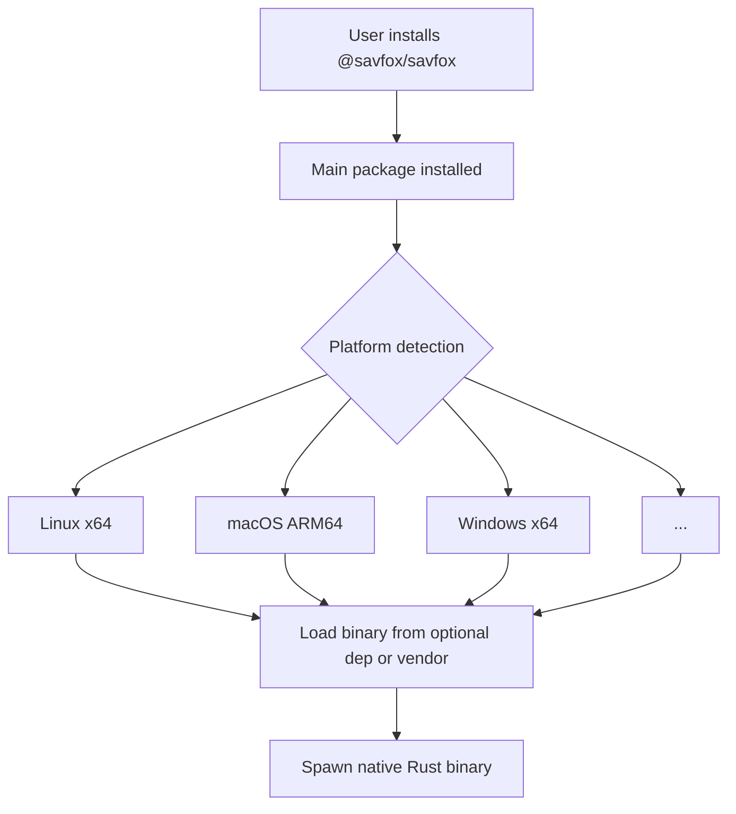

# Savfox NPM Package - Quick Start Guide

## ✅ Implementation Complete

A complete npm package structure has been added to the Savfox project, enabling distribution via npm.

## 📁 What Was Created

```
savfox/
├── nodejs/                          # NPM package root
│   ├── bin/
│   │   └── savfox.js               # Platform detection wrapper
│   ├── scripts/
│   │   ├── build-binaries.sh       # Build all platforms (Unix)
│   │   ├── build-binaries.bat      # Build Windows
│   │   ├── package-npm.sh          # Package for npm (Unix)
│   │   ├── package-npm.bat         # Package for npm (Windows)
│   │   └── dev.js                  # Development helper
│   ├── package.json                # Main package definition
│   ├── package.dev.json            # Dev dependencies
│   ├── .gitignore                  # Ignore build artifacts
│   ├── README.md                   # Full documentation
│   ├── BUILD.md                    # Build instructions
│   └── IMPLEMENTATION.md           # Implementation summary
└── .github/
    └── workflows/
        └── publish-npm.yml         # Automated publishing
```

## 🚀 Quick Start

### Local Development (Windows)

```powershell
# From project root
cd nodejs

# Install dev dependencies (optional)
npm install

# Build, vendor, and test in one command
npm run dev

# Or step-by-step
npm run build        # Build Rust binary
npm run vendor       # Copy to vendor directory
npm run test         # Test the wrapper
```

### Local Development (Linux/macOS)

```bash
# From project root
cd nodejs

# Make scripts executable
chmod +x scripts/*.sh

# Build, vendor, and test in one command
npm run dev

# Or step-by-step
npm run build        # Build Rust binary
npm run vendor       # Copy to vendor directory
npm run test         # Test the wrapper
```

### Building for Distribution

```bash
# Build all platform binaries (requires cross-compilation setup)
npm run build:all

# Package for npm distribution
npm run package
```

## 📦 Package Structure

The npm package follows a two-tier architecture:

1. **Main Package** (`@savfox/savfox`)
   - Platform-agnostic Node.js wrapper
   - Auto-detects OS and architecture
   - Spawns appropriate platform binary

2. **Platform Packages** (optional dependencies)
   - `@savfox/savfox-linux-x64`
   - `@savfox/savfox-linux-arm64`
   - `@savfox/savfox-darwin-x64`
   - `@savfox/savfox-darwin-arm64`
   - `@savfox/savfox-win32-x64`
   - `@savfox/savfox-win32-arm64`

## 🔧 How It Works



## 📋 Next Steps

### 1. Test Locally

```bash
# Build the package
cd nodejs
npm run dev

# Test the wrapper
node bin/savfox.js --version
node bin/savfox.js --help
```

### 2. Publish to npm

```bash
# Login to npm
npm login

# Build and package
npm run build:all
npm run package

# Publish (dry-run first)
cd ../npm-packages/savfox
npm publish --dry-run

# Actually publish
npm publish --access public
```

### 3. Automated Publishing

The GitHub Actions workflow (`.github/workflows/publish-npm.yml`) will automatically:
- Build binaries for all platforms
- Package npm packages
- Publish to npm registry
- Create release notes

Trigger it by:
- Creating a GitHub release, or
- Manually via `gh workflow run publish-npm.yml -f version=0.3.0`

## 🎯 Key Features

- ✅ **Cross-Platform**: Supports Linux, macOS, Windows (x64 & ARM64)
- ✅ **Auto-Detection**: Automatically selects correct binary
- ✅ **Offline Support**: Can bundle binaries in main package
- ✅ **CI/CD Ready**: GitHub Actions workflow included
- ✅ **Developer Friendly**: Easy local development and testing

## 📚 Documentation

- [README.md](nodejs/README.md) - Full package documentation
- [BUILD.md](nodejs/BUILD.md) - Detailed build instructions
- [IMPLEMENTATION.md](nodejs/IMPLEMENTATION.md) - Implementation overview

## 🔍 Comparison with Codex

| Feature | Codex | Savfox |
|---------|-------|--------|
| Package Scope | `@openai/codex` | `@savfox/savfox` |
| Binary Name | `codex` | `savfox` |
| Platforms | 6 | 6 |
| Architecture | Two-tier | Two-tier ✓ |
| CI/CD | GitHub Actions | GitHub Actions ✓ |

## ⚠️ Important Notes

1. **First Build**: The initial Rust build takes time (compiling all dependencies)
2. **Cross-Compilation**: Building for all platforms requires proper setup
3. **npm Token**: Need `NPM_TOKEN` secret in GitHub for publishing
4. **Version Sync**: Keep version in sync between Cargo.toml and package.json

## 🐛 Troubleshooting

### Build Issues

```bash
# Ensure Rust is up to date
rustup update

# Add required target
rustup target add x86_64-pc-windows-msvc

# Clean and rebuild
cargo clean
cargo build --release -p savfox-cli
```

### Permission Issues (Unix)

```bash
chmod +x nodejs/scripts/*.sh
chmod +x nodejs/vendor/*/savfox/savfox
```

### Binary Not Found

- Ensure platform-specific package is published
- Or bundle binaries in `nodejs/vendor/` directory

## 📞 Support

- Check [BUILD.md](nodejs/BUILD.md) for detailed instructions
- Check [README.md](nodejs/README.md) for full documentation
- Review GitHub Actions workflow logs for CI/CD issues

---

**Status**: ✅ Ready for use

**Last Updated**: 2026-03-02
